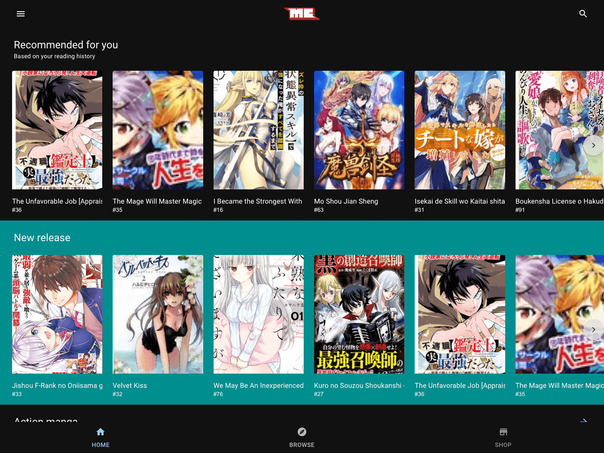

<p align="center">
  Read Manga Online Free | mangakonline.com
</p>



<div align="center">

[](https://david-dm.org/particle4dev/mangakonline-com)
[](https://david-dm.org/particle4dev/mangakonline-com#info=devDependencies)
[](https://coveralls.io/github/particle4dev/mangakonline-com?branch=master)
[](https://github.com/particle4dev/mangakonline-com/issues)
[](https://travis-ci.com/particle4dev/mangakonline-com)

</div>

**This project is bound by a [Code of Conduct][].**

## Technologies used:

- TypeScript (Node.js/JS)
- Next (React.js)
- Material-UI
- (Apollo) GraphQL
- Nest.js
- MeiliSearch
- MongoDB
- Docker

## Quickstart

### Prerequisites

- Nodejs: v14.17.5 or newer

- Yarn: v1.9.4 or newer

- Npm: v7.21.0 or newer

### 1. Install dependencies

First, clone the repo via git:

```bash
$ git clone -b master git@github.com:particle4dev/mangakonline-com-monorepo.git
```

Setup yarn workspace and install dependencies with yarn.

```bash
$ cd mangakonline-com
$ yarn config set workspaces-experimental true
$ yarn policies set-version 1.18.0
$ yarn install
```

### 2. Start MongoDB and MeiliSearch

We launch databases using docker-compose

```sh
$ docker-compose up -d meilisearch mongo
```

### 3. Insert dummy data

Imports migrations into the database

```sh
$ MONGODB_URI="mongodb://127.0.0.1:27017/dev" yarn migrate sync --app=service-mangakonline-graphql-gateway
```

Run migrations
```sh
$ MONGODB_URI="mongodb://localhost:27017/dev" yarn migrate up --name=add-total-chapters-field-in-book-collection --app=service-mangakonline-graphql-gateway
```

### 4. Start services

```sh
$ npx nx run-many --target=serve --projects=service-mangakonline-www,service-mangakonline-graphql-gateway --parallel --maxParallel=10
```

Or you can run those services in background:

```sh
$ tools/run-apps.sh service-mangakonline-www,service-mangakonline-graphql-gateway
```

## Contributing

Familiarize yourself with contributing on github <https://guides.github.com/activities/contributing-to-open-source/>

1. **Fork** the repo on GitHub
2. **Clone** the project to your own machine
3. **Commit** changes to your own branch
4. **Push** your work back up to your fork
5. Submit a **Pull request** so that we can review your changes

## Issues

Feel free to submit issues and enhancement requests.

## Credits

- **Nam Hoang** - _Initial work_ - [particle4dev](https://github.com/particle4dev)

See also the list of [contributors](/AUTHORS.md) who participated in this project.

## License

This project is licensed under the MIT license, Copyright (c) 2021 Nam Hoang. For more information see `LICENSE.md`.
